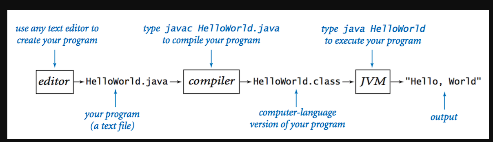

# Java basics
## Java Compilation

Java is a compile based language so before you run your program, first you need to compile your code.
If you're using IDE (Interactive Development Environment), like Intellij IDEA, you can press green "start" button and IDE will take care of this compilation.

## JAVA types
In Java we have two types of variables:
- **Primitive variables** - these are java basic variables, like boolean, int, double, char... For comparing these variables == can be used.

        boolean type1;          // Possible values: true, false
        byte type2;             // Possible values: -128 to 128
        short type3;            // Possible values: -32768 to 32767
        int type4;              // Possible values: -2147483648 to 2147483647
        long type5;             // Possible values: -9223372036854775808 to 9223372036854775807
        float type6;            // Possible values: decimal type, up to 7 decimal digits
        double type7;           // Possible values: decimal type, up to 16 decimal digits
        char type8;             // Possible values: different letter representations, like 'a', 'b', 'c', etc.

- **Reference variables** - these are variables which reference an object, like `String`. Actually such variables don't hold any value in them, but instead they hold an address to the place where some value is held. Because of that, we cannot use `==` comparison with such variables, as it will compare if two variables have exact same address and not the value which resides in the address.

## Arrays
Arrays are data structures, which can hold multiple values of some variables (like multiple int values, or multiple different String values).
It is defined with such syntax (int is used as example, other types can be used also): 

    int[] myNumberArray = {2, 6, 5, 9};

In order to get a value from array you need to use index, which starts from 0. So in order to get value 5 from our myNumberArray you will have to ask for value from 2 index like this:

    myNumberArray[2]

## Loops
Loops are meant to be used where you want your code to be repeated n times. There are two types of loops:

- "For loop" - most commonly used and are defined in such syntax:

      for(int i = 0; i < 5; i++) {... some code which will be run 5 times ...}

  This syntax can be split in three parts:
    - `int i = 0` - we define an "index" which will have a starting value of 0.
    - `i < 5` - we define how many times this loop needs to be run. In this case we will continue running this loop until `i` is less than 5.
    - `i++` - we define an operation which will happen once one loop cycle ends. In this case after each loop, we will increase `i` by 1 (`i++` is the same as `i = i + 1`).

- "While loop" - loop which will continue to run until provided condition is evaluated as true:

      int i = 0;
      while(i < 5) {... some code which will run as long as i is less than 5, but you need to define i outside of loop! ...}

    - While loops are great if you want to run something on a specific condition or if you want a never ending loop, you can always write:

          while(true) {... some code which will run till you close the program, because while condition is always true ...}

It is possible to exit a any loop using `break;` statement.
### IMPORTANT FOR UNDERSTANDING LOOP SCOPE!!!
Things defined in loop, stays in loop! E.g. this will not compile:

    for (int i = 0; i < 10000; i++) {
        int anything = 5;
    }
    
    System.out.println(anything);

Anything initialized in a loop will be reinitialized with each loop cycle. E.g. this will always print 6, no matter how many cycles loop will run:

    for (int i = 0; i < 10000; i++) {
        int anything = 5;
        anything = anything + 1;
        System.out.println(anything);
    }

